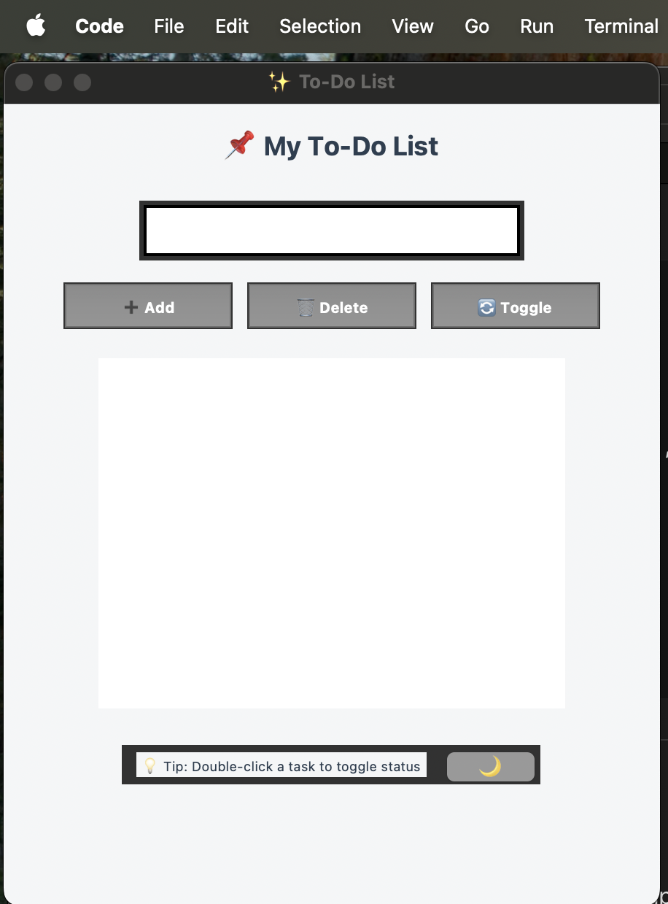
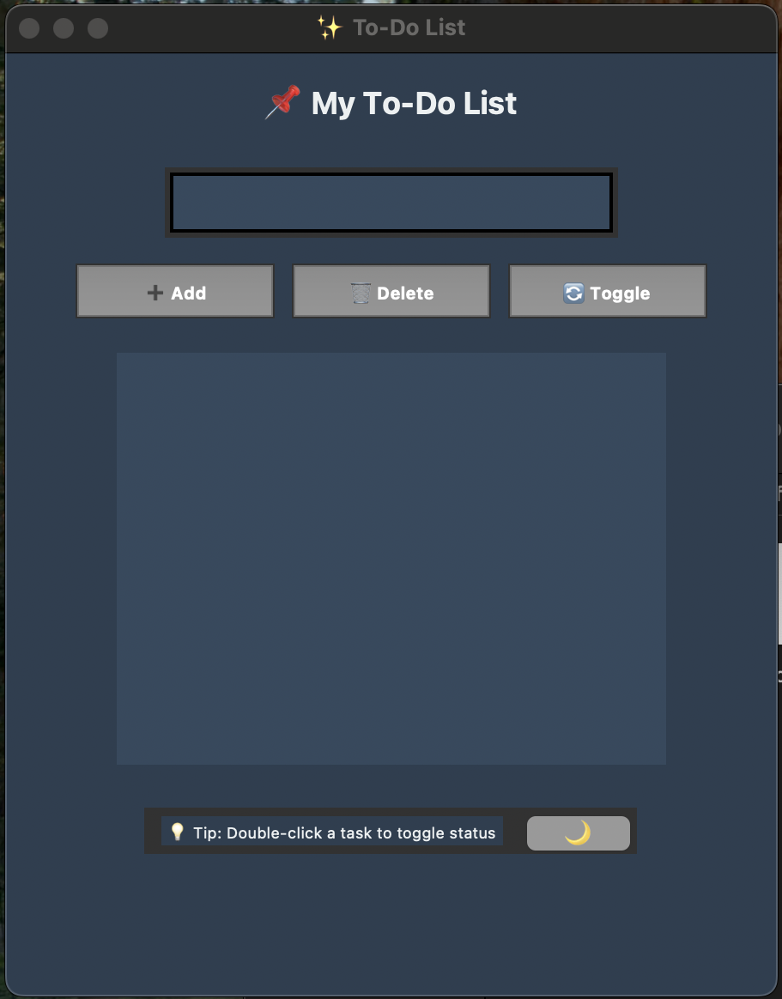

# ✅ To-Do List Application (CodSoft Task 01)

This project was completed as part of my **Python Programming Internship** at **CodSoft** (Task 01).
The objective of this task was to build a **Beginner-Friendly To-Do List Application** in Python with a **modern, humanized GUI**.
The system allows users to **add, delete, and toggle tasks** with a **Day/Night theme switcher** for better user experience.

---

## 📌 Task Objective

Develop a **Python GUI application** that:

* Provides a **To-Do List interface** using **Tkinter**.
* Allows users to **Add, Delete, and Toggle tasks (✔️/❌)**.
* Implements a **Day 🌞 / Night 🌙 theme switcher**.
* Delivers a **professional & user-friendly design**.
* Acts as a **lightweight productivity tool** for daily task management.

---

## 🛠️ Technologies Used

* **Python 3**
* **Tkinter** – GUI library for building the interface
* **Messagebox** – for user-friendly alerts
* **Custom Styling** – for modern Day/Night toggle UI

---

## 📁 Project Structure

```
todo_list_app/
├── todo_app.py         # Main GUI application
├── README.md           # Project documentation
```

---

## 🖼️ Screenshots

### 🔹 Day Mode (Light Theme)

  

### 🔹 Night Mode (Dark Theme)

  

---

## 🎯 Features

* ➕ **Add new tasks**
* 🗑️ **Delete tasks**
* 🔄 **Toggle task status (❌ Pending → ✔️ Done)**
* 🌞 / 🌙 **Day & Night theme switcher**
* 🖱️ **Double-click tasks to toggle status instantly**
* 🎨 **Professional & minimal UI design**

---

## 📊 Example Usage

1. Open the app → default starts in **Day Mode**.
2. Add tasks like:

   ```
   ❌ Complete Python Assignment
   ❌ Submit Internship Task
   ```
3. Double-click or press **Toggle** → task updates to ✔️ Done.
4. Switch to **Night Mode** 🌙 for a darker, eye-friendly look.

---

## 🖥️ How to Run

1. Install Python (3.8+ recommended).
   Verify with:

   ```bash
   python --version
   ```

2. Save the script as `todo_app.py`.

3. Run the app with:

   ```bash
   python todo_app.py
   ```

4. The To-Do List window will open.

---

## 🔧 Future Enhancements

* 💾 Save tasks to **JSON/Database** for persistence.
* 📝 Add **categories / priorities** (Work, Study, Personal).
* ⏰ Integrate **reminders & deadlines**.
* 📱 Convert into a **mobile app** with Kivy / Flutter.
* 🌐 Deploy as a **web app** using Flask/Streamlit.

---

## 🎓 Internship & Task Details

* **Internship Track**: Python Programming
* **Internship Provider**: CodSoft
* **Task Name**: To-Do List Application (Task 01)
* **Environment**: Python + Tkinter

---

## 📬 Contact

* **Name**: Difina George
* 📧 **Email**: [difina.georgecs@gmail.com](mailto:difina.georgecs@gmail.com)
* 📍 **Location**: Kerala, India
